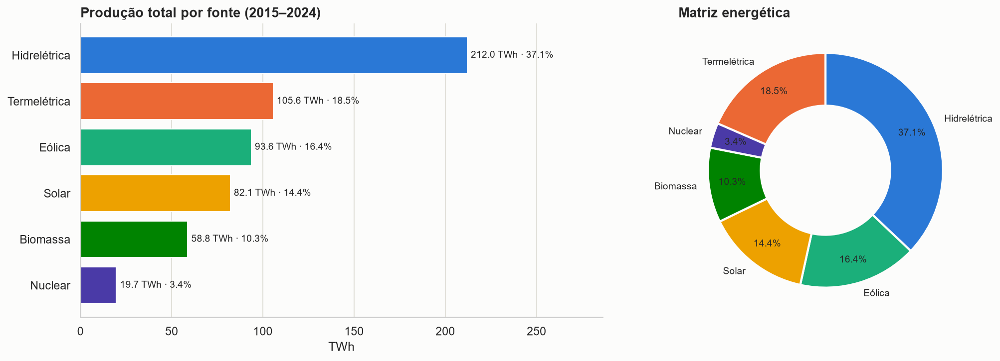
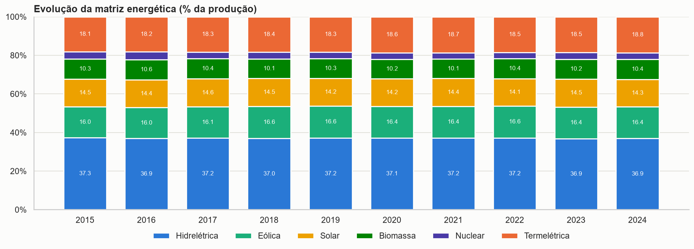

# Produção de Energia no Brasil (2015–2024)

**Projeto G1 — Tema 6** · Análise e visualização de dados com Python

| | |
|---|---|
| **Disciplina** | Linguagem de Programação — Análise e Visualização de Dados com Python |
| **Professor** | Alexandre Neves Louzada |
| **Aluno** | Enzo Ribas Torres |

| Entrega | Link |
|---|---|
| Dashboard (Streamlit Community Cloud) | https://projeto-producao-energia.streamlit.app/ |
| Página do projeto (GitHub Pages) | https://marcusfilipem1.github.io/projeto-producao-energia/ |
| Repositório (GitHub) | https://github.com/marcusfilipem1/projeto-producao-energia |
| Notebook | [`notebooks/analise_producao_energia.ipynb`](notebooks/analise_producao_energia.ipynb) |
| Código do dashboard | [`app.py`](app.py) e [`paginas/`](paginas/) |
| Base de dados | [`dados/simulacao_producao_energia_brasil.csv`](dados/simulacao_producao_energia_brasil.csv) |

---

## Sobre o projeto

A produção de energia é um dos principais indicadores de desenvolvimento econômico e de infraestrutura. Este projeto
analisa a produção e o consumo de energia no Brasil entre 2015 e 2024, usando uma base simulada com **14.400 registros
mensais** (20 estados × 6 fontes × 120 meses).

### Perguntas orientadoras

1. Quais fontes energéticas predominam no Brasil?
2. Quais regiões produzem mais energia?
3. Houve crescimento da energia renovável?
4. Existe sazonalidade na geração?
5. Quais estados possuem maior produção?
6. Há redução da dependência hidrelétrica?
7. Como a matriz energética evoluiu ao longo do tempo?

## Principais resultados

| KPI | Valor |
|---|---|
| Produção total de energia | **571,8 TWh** |
| Fonte predominante | **Hidrelétrica** (37,1%) |
| Percentual renovável | **78,1%** (nuclear tratada como não renovável) |
| Estado com maior produção | **Espírito Santo** (28,8 TWh, praticamente empatado com São Paulo) |
| Consumo total | **543,0 TWh** (a produção cobre 105,3%) |
| Emissão total de CO₂ | **87,3 Mt** (153 kg por MWh) |



- **A produção cresce 4,22% ao ano** (46,7 → 67,7 TWh), mas **a matriz não muda**: as renováveis ficaram em 78% do
  início ao fim da série, e a participação hidrelétrica caiu só 0,38 p.p.
- **A termelétrica concentra as emissões**: com 18,5% da produção, gera 78,6% do CO₂ (650 kg/MWh, contra 40 kg/MWh das
  demais fontes). As emissões cresceram 48,8% em dez anos.
- **Não há sazonalidade relevante**: os meses variam só 2% e o padrão não se repete entre os anos.
- **Estados produzem volumes quase iguais** (28,3 a 28,8 TWh). O Nordeste lidera entre as regiões só por ter 5 estados
  na base.



## Dashboard

App Streamlit **multipágina** com gráficos interativos em Plotly, filtros globais na barra lateral (ano, mês, região,
estado, fonte de energia e nível de demanda) e upload opcional de outro CSV no mesmo layout.

| Página | Conteúdo |
|---|---|
| Visão geral | Título, descrição do problema, identificação, 6 KPIs, destaques, linha temporal, pizza da matriz e resumo da conclusão |
| Evolução e sazonalidade | Produção × consumo (mensal/anual), área por fonte, crescimento anual, tabela com média móvel, heatmap do índice sazonal e perfil sazonal por fonte |
| Fontes e matriz energética | Barras por fonte, pizza (por fonte ou classe), evolução da matriz (100%), participação renovável e hidrelétrica, crescimento por fonte |
| Regiões e estados | Mapa coroplético (produção, saldo ou CO₂), barras por estado (por região ou por fonte), ranking e comparação regional |
| Produção × consumo | Dispersão consumo × produção, nível de demanda por ano e saldo por estado |
| Impacto ambiental | Dispersão emissão × produção, participação na produção × nas emissões, emissões anuais, fator de emissão e matriz de correlação |
| Explorar dados e SQL | Tabela dinâmica configurável, editor SQL (somente leitura) e download da base filtrada |
| Conclusão executiva | Respostas às perguntas orientadoras, recomendações e limitações |

Todas as páginas têm interpretação textual que se ajusta ao recorte filtrado.

## Funcionalidades

**Intermediárias:** filtros múltiplos, KPIs dinâmicos, gráficos interativos, análise temporal, tratamento avançado de
dados, integração entre tabelas, upload de arquivos, dashboard organizado em seções, visualizações comparativas e
análise geográfica.

**Avançadas:**

| Funcionalidade | Tecnologia | Onde |
|---|---|---|
| Gráficos avançados | Plotly | [`src/graficos.py`](src/graficos.py) |
| Mapa interativo | Plotly + GeoJSON do IBGE | [`src/graficos.py`](src/graficos.py) |
| Consumo de API | Requests (API de dados do IBGE) | [`src/ibge.py`](src/ibge.py) |
| Persistência em banco | SQLAlchemy + SQLite | [`src/banco.py`](src/banco.py), `database/` |
| Modelagem relacional | SQLAlchemy ORM (4 tabelas com chaves estrangeiras) | [`src/banco.py`](src/banco.py) |
| Dashboard multipágina | Streamlit `st.navigation` | [`app.py`](app.py), [`paginas/`](paginas/) |
| Séries temporais | Pandas/NumPy (crescimento composto, tendência, média móvel, índice sazonal) | [`src/analise.py`](src/analise.py) |
| Correlação estatística | Pandas/NumPy (Pearson, Spearman) | [`src/analise.py`](src/analise.py) |
| Integração de múltiplas fontes | CSV + API + banco | todo o pipeline |

## Tratamento dos dados

| Etapa | Resultado |
|---|---|
| Nulos, duplicados (estado × fonte × mês), datas incoerentes, valores negativos | Nenhum encontrado |
| Valores no piso artificial de 100 MWh | **452 registros sinalizados** (450 de nuclear, 2 de biomassa); somam 0,008% da produção |
| Nuclear marcada como 95% renovável no CSV | **Reclassificada como não renovável**; percentual renovável recalculado pela produção |
| Nível de demanda | Regra confirmada: consumo ÷ produção < 0,85 Baixo · < 1,00 Médio · < 1,12 Alto · ≥ 1,12 Crítico |
| Proporções fixas da simulação | Fator de emissão (0,04 t/MWh; 0,65 na termelétrica) e fator de capacidade (71,4%) documentados |
| Engenharia de atributos | Saldo, índice de demanda, fator de emissão, classe da fonte, trimestre, período hidrológico, nome e código IBGE das UFs |

## Estrutura

```
projeto-producao-energia/
├── app.py                  # entrada do dashboard: dados, filtros globais, navegação
├── paginas/                # páginas do dashboard multipágina
├── src/
│   ├── config.py           # identificação, caminhos, classificação das fontes e paleta
│   ├── dados.py            # leitura, limpeza, atributos e filtros
│   ├── ibge.py             # consumo da API do IBGE
│   ├── banco.py            # modelos SQLAlchemy e consultas SQL
│   ├── analise.py          # KPIs, crescimento, sazonalidade e textos
│   ├── graficos.py         # gráficos Plotly e Matplotlib/Seaborn
│   └── ui.py               # componentes visuais
├── requirements.txt
├── README.md
├── index.html              # página do GitHub Pages
├── css/style.css           # estilos da página
├── dados/                  # CSV original, CSV tratado e cache do IBGE
├── database/               # producao_energia.sqlite
├── notebooks/              # analise_producao_energia.ipynb
└── imagens/                # gráficos exportados pelo notebook
```

## Como executar

```bash
python -m venv .venv
.venv\Scripts\activate          # Windows  (Linux/macOS: source .venv/bin/activate)
pip install -r requirements.txt
streamlit run app.py
```

O notebook pode ser aberto no VS Code ou no Jupyter (`pip install jupyter`) a partir da pasta `notebooks/`.

## Tecnologias

Python · Pandas · NumPy · Plotly · Matplotlib · Seaborn · Streamlit · SQLAlchemy · SQLite · Requests · GitHub Pages

## Limitações

A base é **simulada**: fator de emissão, fator de capacidade e participação das fontes são praticamente constantes, e a
produção por estado é quase igual, o que não ocorre no sistema elétrico real. A análise é descritiva: correlação não
implica causalidade.
